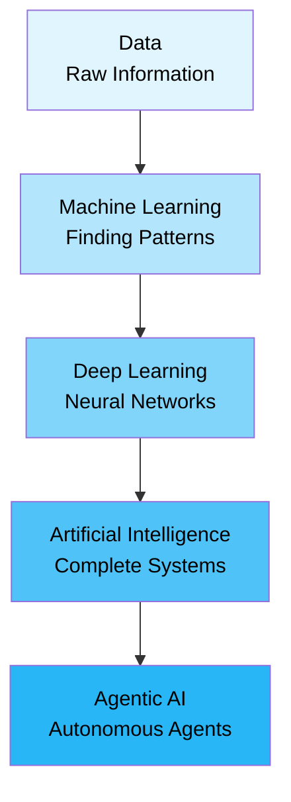
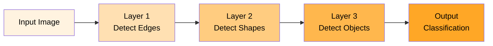

# 1. Introduction to AI: The Complete Journey


## 🎯 Learning Objectives

By the end of this section, you'll understand:
- The evolution from data to Agentic AI
- Why data is the foundation of everything
- The relationship between ML, Deep Learning, and AI
- Why Agentic AI is more about software engineering than core AI

---

## 📊 The AI Hierarchy: Building from the Ground Up

Think of AI like building a house. You can't start with the roof - you need a solid foundation first!



### 1. **Data** - The Foundation 🏗️

**What is it?** Raw information, facts, numbers, text, images - everything!

**Real-world example:** 
- A pizza shop tracking: customer names, order times, pizza types, prices
- An e-commerce site storing: product images, customer reviews, purchase history

**Why it matters:** Without data, nothing works. It's like trying to bake without ingredients!

```python
# Example: Simple data structure
customer_data = {
    "name": "Rajesh",
    "orders": ["Margherita", "Pepperoni", "Margherita"],
    "total_spent": 1200
}
```

**Business Application:** Companies like Amazon collect billions of data points daily - what you view, buy, search for. This data is worth billions!

---

### 2. **Machine Learning (ML)** - Finding Patterns 🔍

**What is it?** Teaching computers to learn from data and make predictions.

**Real-world example:**
- **Netflix Recommendations:** "Users who watched Stranger Things also liked..."
- **Email Spam Filter:** Learning which emails are spam based on patterns
- **Credit Card Fraud Detection:** Identifying suspicious transactions

**The Magic:** Instead of programming every rule, ML finds patterns automatically!

```python
# Simple ML concept: Learning from examples
# If 1000 people bought pizza on Friday evenings
# ML learns: "Friday evening = high pizza demand"
```

**Business Application:** 
- **Flipkart** uses ML to predict what you'll buy next
- **Zomato** uses ML to estimate delivery time
- **Banks** use ML to approve/reject loans

---

### 3. **Deep Learning** - The Brain Simulator 🧠

**What is it?** ML with artificial "neural networks" that mimic how our brain works.

**Real-world example:**
- **Face Recognition:** Your phone unlocking with your face
- **Voice Assistants:** Alexa, Siri understanding your speech
- **Image Recognition:** Google Photos finding all photos of "dogs"

**Why "Deep"?** Multiple layers of neurons process information, just like our brain!



```python
# Deep Learning = Multiple layers of processing
# Input Image → Layer 1 (edges) → Layer 2 (shapes) → Layer 3 (objects) → Output
```

**Business Application:**
- **Medical Diagnosis:** Detecting cancer from X-rays
- **Self-Driving Cars:** Recognizing traffic signs
- **Language Translation:** Google Translate

---

### 4. **Artificial Intelligence (AI)** - The Big Picture 🤖

**What is it?** The umbrella term for machines that can perform tasks requiring human intelligence.

**Real-world example:**
- **ChatGPT:** Having conversations like a human
- **Chess AI:** Beating world champions
- **Autonomous Robots:** Working in warehouses

**The Key:** AI combines ML, Deep Learning, rules, and logic to solve complex problems.

**Business Application:**
- **Customer Service Bots:** Handling 24/7 customer queries
- **Supply Chain Optimization:** Managing inventory automatically
- **Personalized Marketing:** Creating custom ads for each user

---

### 5. **Agentic AI** - The Smart Assistant 👨‍💼

**What is it?** AI that can act independently, make decisions, and complete tasks.

**Real-world example:**
- **AI Assistant:** "Book a flight to Mumbai" → It searches, compares, books
- **Trading Bot:** Monitors market, makes trades automatically
- **Code Assistant:** Writes, tests, and deploys code

**Why "Agentic"?** It's an "agent" - it acts on your behalf!

```python
# Agentic AI = AI + Decision Making + Action Taking
# Not just answering questions, but DOING things!
```

---

## 🔑 The Big Insight: Agentic AI = Elevated Software Engineering

### Why Agentic AI is More Engineering Than Core AI

**Traditional AI:** 
- Focus: Making models smarter
- Goal: Better accuracy, faster processing
- Example: Making a chatbot understand better

**Agentic AI:**
- Focus: Building systems that work reliably
- Goal: Creating robust, secure, production-ready applications
- Example: Building a chatbot that safely handles legal advice

### The Shift:

| Aspect | Core AI | Agentic AI |
|--------|---------|-------------|
| **Primary Focus** | Model performance | System reliability |
| **Skills Needed** | Math, algorithms | Software engineering |
| **Concerns** | Accuracy, speed | Security, safety, scalability |
| **Example** | "Make it understand" | "Make it safe and useful" |

**Real-world analogy:**
- **Core AI** = Building a powerful engine
- **Agentic AI** = Building a complete, safe, road-worthy car

**Business Application:**
- Companies need **AI Engineers** (not just AI researchers)
- Focus on: Security, prompt engineering, system design
- Building products, not just models

---

## 🎓 What Level of Python Do You Need?

### For AI Engineering, You Need:

#### ✅ **Must Know:**
1. **Basics:** Variables, loops, functions, conditionals
2. **Data Structures:** Lists, dictionaries, tuples, sets
3. **File Handling:** Reading/writing files
4. **Error Handling:** Try-except blocks
5. **Modules:** Importing and using libraries

#### ✅ **Should Know:**
1. **Object-Oriented Programming:** Classes, inheritance
2. **Decorators:** Function wrappers
3. **Type Hints:** Making code clearer
4. **List Comprehensions:** Pythonic code
5. **Lambda Functions:** Quick functions

#### ✅ **Nice to Have:**
1. **Async/Await:** For handling multiple tasks
2. **Generators:** Memory-efficient code
3. **Context Managers:** Resource management

**Good News:** We'll cover all of this in the next sections! 🎉

---

## 🎯 Key Takeaways

1. **Data is Everything:** Start with good data
2. **ML → DL → AI:** Each builds on the previous
3. **Agentic AI:** More about building systems than training models
4. **Python Level:** Intermediate is enough, we'll teach you the rest!

---

## 💡 Real-World Business Examples

### Example 1: E-commerce Recommendation
- **Data:** Customer purchase history
- **ML:** Finds patterns (customers who buy A also buy B)
- **Deep Learning:** Understands complex preferences
- **AI:** Creates personalized shopping experience
- **Agentic AI:** Automatically adjusts prices, manages inventory

### Example 2: Healthcare Diagnosis
- **Data:** Patient records, X-ray images
- **ML:** Identifies common patterns
- **Deep Learning:** Recognizes complex medical conditions
- **AI:** Suggests diagnoses
- **Agentic AI:** Schedules follow-ups, manages patient care

---

## 🚀 Next Steps

Ready to dive into Python? Let's move to:
- **Section 2:** Python for AI - All the essentials you need!

---

**Remember:** Every expert was once a beginner. You've got this! 💪


