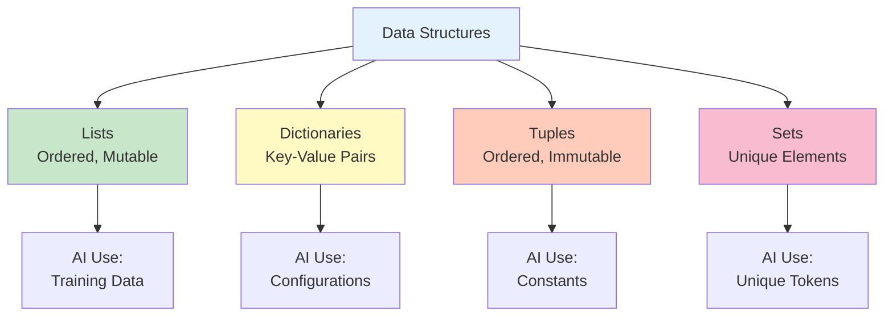

# 2. Python for AI: Essential Skills


## 🎯 Learning Objectives

By the end of this section, you'll:
- Master Python syntax essentials for AI
- Understand data structures used in AI
- Learn to work with AI libraries
- Write clean, Pythonic code

---

## 🐍 Python Basics: Quick Refresher

### Variables & Data Types

```python
# Numbers
age = 25
price = 99.99
is_active = True

# Strings
name = "Rajesh"
message = f"Hello, {name}! You are {age} years old."

# Lists (ordered, changeable)
fruits = ["apple", "banana", "orange"]
fruits.append("mango")

# Dictionaries (key-value pairs)
student = {
    "name": "Priya",
    "age": 22,
    "grades": [85, 90, 88]
}
```

**AI Application:** Storing model configurations, training data, results

---

## 📊 Data Structures for AI



### Lists - Your Best Friend

```python
# Creating lists
numbers = [1, 2, 3, 4, 5]
names = ["Alice", "Bob", "Charlie"]

# List operations
first = numbers[0]  # 1
last = numbers[-1]  # 5
subset = numbers[1:4]  # [2, 3, 4]

# List comprehensions (Pythonic way!)
squares = [x**2 for x in range(10)]
even_squares = [x**2 for x in range(10) if x % 2 == 0]
```

**AI Application:** Processing batches of data, storing predictions

### Dictionaries - Organizing Data

```python
# Creating dictionaries
config = {
    "model_name": "gpt-4",
    "temperature": 0.7,
    "max_tokens": 1000
}

# Accessing values
model = config["model_name"]
temperature = config.get("temperature", 0.5)  # Safe access

# Updating
config["temperature"] = 0.9
config["top_p"] = 0.95  # Adding new key
```

**AI Application:** Storing API configurations, model parameters

---

## 🔄 Control Flow

### If-Else Statements

```python
score = 85

if score >= 90:
    grade = "A"
elif score >= 80:
    grade = "B"
else:
    grade = "C"

print(f"Grade: {grade}")
```

**AI Application:** Decision making in AI systems, conditional logic

### Loops

```python
# For loop
for i in range(5):
    print(f"Training epoch {i+1}")

# Iterating over list
data = [10, 20, 30, 40]
for value in data:
    print(value * 2)

# While loop
epoch = 0
while epoch < 10:
    print(f"Epoch {epoch}")
    epoch += 1
```

**AI Application:** Training loops, processing data batches

---

## 🎯 Functions: Reusable Code Blocks

### Basic Functions

```python
def greet(name):
    """Simple greeting function"""
    return f"Hello, {name}!"

result = greet("Rajesh")
print(result)  # Hello, Rajesh!
```

### Functions with Default Parameters

```python
def calculate_total(price, tax=0.18, discount=0):
    """Calculate total with tax and discount"""
    subtotal = price * (1 - discount)
    total = subtotal * (1 + tax)
    return total

# Using defaults
total1 = calculate_total(1000)  # tax=0.18, discount=0

# Overriding defaults
total2 = calculate_total(1000, tax=0.20, discount=0.10)
```

**AI Application:** Reusable functions for data processing, API calls

---

## 📦 Working with Libraries

### Importing Libraries

```python
# Standard library
import json
import os
from datetime import datetime

# Third-party libraries (for AI)
import requests  # For API calls
import pandas as pd  # For data manipulation
import numpy as np  # For numerical operations
```

### Using AI Libraries

```python
# Example: Using requests for API calls
import requests

def call_ai_api(prompt):
    """Call an AI API with a prompt"""
    url = "https://api.example.com/chat"
    headers = {"Authorization": "Bearer YOUR_KEY"}
    data = {"prompt": prompt}
    
    response = requests.post(url, json=data, headers=headers)
    return response.json()

# Usage
result = call_ai_api("Explain AI in simple terms")
print(result)
```

---

## 🛡️ Error Handling

### Try-Except Blocks

```python
def safe_divide(a, b):
    """Safely divide two numbers"""
    try:
        result = a / b
        return result
    except ZeroDivisionError:
        print("Error: Cannot divide by zero!")
        return None
    except TypeError:
        print("Error: Please provide numbers!")
        return None

# Usage
result1 = safe_divide(10, 2)  # 5.0
result2 = safe_divide(10, 0)  # None (error handled)
```

**AI Application:** Handling API errors, data validation

---

## 📝 File Operations

### Reading Files

```python
# Reading text file
with open("data.txt", "r") as file:
    content = file.read()
    print(content)

# Reading JSON file
import json

with open("config.json", "r") as file:
    config = json.load(file)
    print(config)
```

### Writing Files

```python
# Writing text file
data = "Hello, AI World!"
with open("output.txt", "w") as file:
    file.write(data)

# Writing JSON file
config = {
    "model": "gpt-4",
    "temperature": 0.7
}

with open("config.json", "w") as file:
    json.dump(config, file, indent=2)
```

**AI Application:** Loading training data, saving model configurations

---

## 🎨 Pythonic Code: Best Practices

### List Comprehensions

```python
# Instead of this:
squares = []
for x in range(10):
    squares.append(x**2)

# Do this:
squares = [x**2 for x in range(10)]
```

### Dictionary Comprehensions

```python
# Creating dictionary from list
names = ["Alice", "Bob", "Charlie"]
name_lengths = {name: len(name) for name in names}
# {'Alice': 5, 'Bob': 3, 'Charlie': 7}
```

### Lambda Functions

```python
# Quick functions
add = lambda x, y: x + y
result = add(5, 3)  # 8

# Using with map
numbers = [1, 2, 3, 4, 5]
doubled = list(map(lambda x: x * 2, numbers))
# [2, 4, 6, 8, 10]
```

---

## 🔧 Practical Example: Simple AI Data Processor

```python
def process_ai_data(data_list):
    """Process a list of data for AI training"""
    # Filter valid data
    valid_data = [item for item in data_list if item is not None]
    
    # Calculate statistics
    total = len(valid_data)
    average = sum(valid_data) / total if total > 0 else 0
    
    # Create summary
    summary = {
        "total_items": total,
        "average": average,
        "max": max(valid_data) if valid_data else 0,
        "min": min(valid_data) if valid_data else 0
    }
    
    return summary

# Usage
data = [10, 20, 30, None, 40, 50]
result = process_ai_data(data)
print(result)
# {'total_items': 5, 'average': 30.0, 'max': 50, 'min': 10}
```

---

## 💡 Real-World Business Example

### E-commerce Product Analyzer

```python
def analyze_products(products):
    """Analyze product data for AI recommendations"""
    # Extract prices
    prices = [p["price"] for p in products if "price" in p]
    
    # Calculate statistics
    avg_price = sum(prices) / len(prices) if prices else 0
    expensive = [p for p in products if p.get("price", 0) > avg_price]
    
    # Create report
    report = {
        "total_products": len(products),
        "average_price": avg_price,
        "expensive_count": len(expensive),
        "recommendations": expensive[:5]  # Top 5 expensive
    }
    
    return report

# Usage
products = [
    {"name": "Laptop", "price": 50000},
    {"name": "Mouse", "price": 500},
    {"name": "Keyboard", "price": 2000}
]

result = analyze_products(products)
print(result)
```

---

## 🎯 Key Takeaways

1. **Lists & Dictionaries:** Your primary data structures
2. **Functions:** Write reusable, clean code
3. **Error Handling:** Always handle errors gracefully
4. **Pythonic Code:** Use comprehensions, lambdas for cleaner code
5. **Libraries:** Leverage existing tools (requests, pandas, etc.)

---

## 🚀 Next Steps

Ready for advanced concepts? Let's move to:
- **Section 3:** Advanced Python - OOP, Pydantic, Decorators

---

**Pro Tip:** Practice these concepts by writing small programs. The more you code, the better you get! 💪


