# 8. Math Fundamentals: Softmax, Tokenization & Temperature


## 🎯 Learning Objectives

By the end of this section, you'll:
- Understand the Softmax function
- Learn tokenization mathematics
- Master the temperature parameter
- See how these concepts apply to AI

---

## 📊 Part 1: Softmax Function

### What is Softmax?

**Softmax = Converts numbers into probabilities**

**Real-world analogy:**
- Like converting exam scores (0-100) into grades (A, B, C probabilities)
- Like a voting system where each option gets a probability

### Simple Explanation

Imagine you have 3 options and their "scores":
- Option A: 5 points
- Option B: 3 points  
- Option C: 2 points

Softmax converts these into probabilities:
- Option A: 70% chance
- Option B: 20% chance
- Option C: 10% chance

**Total = 100%** (all probabilities add up to 1)

### Mathematical Formula

```
Softmax(x_i) = e^(x_i) / Σ(e^(x_j)) for all j
```

**In simple terms:**
1. Take exponential (e^x) of each number
2. Sum all exponentials
3. Divide each exponential by the sum

```mermaid
graph LR
    A[Input Scores<br/>5, 3, 2] --> B[Calculate e^x<br/>e^5, e^3, e^2]
    B --> C[Sum Exponentials<br/>Σ e^x]
    C --> D[Divide Each<br/>e^x / Σ]
    D --> E[Probabilities<br/>0.84, 0.11, 0.05]
    
    style A fill:#e3f2fd,color:#000000
    style B fill:#fff3e0,color:#000000
    style C fill:#f3e5f5,color:#000000
    style D fill:#e8f5e9,color:#000000
    style E fill:#c8e6c9,color:#000000
```



### Python Implementation

```python
import math

def softmax(scores):
    """Calculate softmax probabilities"""
    # Step 1: Calculate exponentials
    exp_scores = [math.exp(score) for score in scores]
    
    # Step 2: Calculate sum
    sum_exp = sum(exp_scores)
    
    # Step 3: Calculate probabilities
    probabilities = [exp / sum_exp for exp in exp_scores]
    
    return probabilities

# Example
scores = [5, 3, 2]
probabilities = softmax(scores)

print("Scores:", scores)
print("Probabilities:", probabilities)
print("Sum:", sum(probabilities))  # Should be 1.0

# Output:
# Scores: [5, 3, 2]
# Probabilities: [0.84, 0.11, 0.05] (approximately)
# Sum: 1.0
```

### Using NumPy (Faster)

```python
import numpy as np

def softmax_numpy(scores):
    """Softmax using NumPy"""
    exp_scores = np.exp(scores)
    return exp_scores / np.sum(exp_scores)

# Example
scores = np.array([5, 3, 2])
probabilities = softmax_numpy(scores)
print(probabilities)
```

### Why Softmax in AI?

**AI Use Case:** When AI needs to choose between multiple options:

```python
# AI predicting next word
word_scores = {
    "hello": 8.5,
    "hi": 7.2,
    "hey": 6.1,
    "greetings": 2.3
}

# Convert to probabilities
scores_list = list(word_scores.values())
probabilities = softmax(scores_list)

# Create probability dictionary
word_probs = dict(zip(word_scores.keys(), probabilities))

print("Word Probabilities:")
for word, prob in word_probs.items():
    print(f"{word}: {prob:.2%}")
```

**Business Application:**
- **Recommendation Systems:** Probability of user liking each product
- **Classification:** Probability of email being spam
- **Language Models:** Probability of next word

---

## 🔤 Part 2: Tokenization Mathematics

### What is Tokenization?

**Tokenization = Breaking text into smaller pieces (tokens)**

**Real-world analogy:**
- Like cutting a pizza into slices
- Like breaking a sentence into words

### Types of Tokenization


#### 1. **Word-Level Tokenization** (Simple but Limited)

Breaking text into words. Problem: Large vocabulary, can't handle new words.

#### 2. **Character-Level Tokenization** (Too Granular)

Breaking text into individual characters. Problem: Too many tokens, loses word meaning.

#### 3. **Subword Tokenization (BPE - Byte Pair Encoding)**

**Most common in modern AI!**

**What is BPE?**

**BPE = Byte Pair Encoding** - A smart way to break text into pieces that AI can understand efficiently.

**How BPE Works:**
1. **Start with characters:** "Hello" → ['H', 'e', 'l', 'l', 'o']
2. **Find frequent pairs:** Most common character pairs (like 'll' in "Hello")
3. **Merge pairs:** Combine frequent pairs into single tokens
4. **Repeat:** Keep merging until you have a good vocabulary size
5. **Result:** Text broken into subword units (not full words, not single characters)

**Why BPE?**
- **Efficient:** Handles unknown words by breaking them into known subwords
- **Compact:** Smaller vocabulary than word-level, larger than character-level
- **Flexible:** Can handle new words by combining known subwords

**Real-world example:**
- Word: "unhappiness"
- BPE tokens: ["un", "happi", "ness"] (3 tokens)
- Each token is a reusable piece!

**Using tiktoken (OpenAI's BPE implementation):**

```python
import tiktoken

def tokenize_with_bpe(text, model="gpt-3.5-turbo"):
    """Tokenize text using BPE with tiktoken"""
    # Initialize tiktoken encoder
    encoding = tiktoken.encoding_for_model(model)
    
    # Tokenize text
    tokens = encoding.encode(text)
    
    # Decode tokens back to see what they represent
    token_strings = [encoding.decode([token]) for token in tokens]
    
    return {
        "tokens": tokens,
        "token_strings": token_strings,
        "token_count": len(tokens)
    }

# Example
text = "Hello! How are you?"
result = tokenize_with_bpe(text)
print(f"Text: '{text}'")
print(f"Token count: {result['token_count']}")
print(f"Tokens: {result['tokens']}")
print(f"Token strings: {result['token_strings']}")
```

**BPE Tokenization Analysis:**

```python
import tiktoken

def analyze_bpe_tokenization(text, model="gpt-3.5-turbo"):
    """Analyze BPE tokenization statistics"""
    encoding = tiktoken.encoding_for_model(model)
    tokens = encoding.encode(text)
    token_strings = [encoding.decode([token]) for token in tokens]
    
    stats = {
        "original_length": len(text),
        "token_count": len(tokens),
        "tokens_per_character": len(tokens) / len(text) if text else 0,
        "vocabulary_size": encoding.n_vocab,
        "sample_tokens": tokens[:10],
        "sample_token_strings": token_strings[:10]
    }
    
    return stats

# Example
text = "Artificial Intelligence is amazing!"
stats = analyze_bpe_tokenization(text)
print(f"Original: {stats['original_length']} characters")
print(f"Tokens: {stats['token_count']} tokens")
print(f"Vocabulary size: {stats['vocabulary_size']:,}")
print(f"Sample tokens: {stats['sample_tokens']}")
print(f"Sample token strings: {stats['sample_token_strings']}")
```

**Business Application:**
- **Cost Calculation:** AI APIs charge per token
- **Model Size:** Larger vocabulary = larger model
- **Processing Speed:** More tokens = slower processing

---

## 🌡️ Part 3: Temperature Parameter

### What is Temperature?

**Temperature = Controls randomness in AI responses**

**Real-world analogy:**
- **Low Temperature (0.1-0.5):** Like a focused student - gives consistent, predictable answers
- **High Temperature (0.7-2.0):** Like a creative artist - gives varied, creative answers

### What are Logits?

**Logits = Raw scores from the AI model before converting to probabilities**

**Think of it like this:**
- **Logits:** Exam scores (85, 72, 68, 45) - raw numbers
- **Probabilities:** Converted to percentages (70%, 20%, 8%, 2%) - must add up to 100%

**In AI:**
- Model outputs logits for each possible next token
- Higher logit = model thinks this token is more likely
- Logits are then converted to probabilities using softmax
- Temperature modifies logits before softmax

**Example:**
```python
# Logits from AI model (raw scores)
logits = [5.0, 3.0, 2.0, 1.0]
# These mean: token 1 is most likely (score 5.0), token 2 is second (3.0), etc.

# After softmax (probabilities)
probabilities = [0.84, 0.11, 0.04, 0.01]
# Token 1 has 84% chance, token 2 has 11% chance, etc.
```

### How Temperature Works

Temperature modifies **logits** (raw scores) before converting to probabilities:


**The Process:**
1. **Model outputs logits:** Raw scores for each possible token
2. **Divide by temperature:** Scale the logits
3. **Apply softmax:** Convert to probabilities
4. **Sample:** Choose token based on probabilities

```python
import numpy as np

def apply_temperature(logits, temperature=1.0):
    """Apply temperature to logits
    
    Logits are raw scores from the AI model before applying softmax.
    They represent the model's confidence scores for each possible token.
    """
    # Divide by temperature (scales the logits)
    scaled_logits = logits / temperature
    
    # Apply softmax to convert logits to probabilities
    exp_scores = np.exp(scaled_logits)
    probabilities = exp_scores / np.sum(exp_scores)
    
    return probabilities

# Example: Word prediction
# These are logits (raw scores from the model)
word_logits = np.array([5.0, 3.0, 2.0, 1.0])
words = ["hello", "hi", "hey", "greetings"]

print("Original Logits (raw scores):", word_logits)
print()

# Low temperature (0.5) - Makes differences bigger
probs_low = apply_temperature(word_logits, temperature=0.5)
print("Low Temperature (0.5) - More focused:")
for word, prob in zip(words, probs_low):
    print(f"  {word}: {prob:.2%}")

# High temperature (2.0) - Makes differences smaller
probs_high = apply_temperature(word_logits, temperature=2.0)
print("\nHigh Temperature (2.0) - More creative:")
for word, prob in zip(words, probs_high):
    print(f"  {word}: {prob:.2%}")
```

### Temperature Effects

```python
def demonstrate_temperature():
    """Demonstrate temperature effects on logits"""
    # Logits (raw model scores)
    logits = np.array([8.0, 5.0, 3.0, 1.0])
    
    temperatures = [0.1, 0.5, 1.0, 2.0]
    
    print("Temperature Effects on Logits:")
    print(f"Original Logits: {logits}")
    print("-" * 50)
    
    for temp in temperatures:
        # Scale logits by temperature
        scaled_logits = logits / temp
        # Convert to probabilities
        probs = apply_temperature(logits, temp)
        max_prob = max(probs)
        entropy = -np.sum(probs * np.log(probs + 1e-10))  # Measure of randomness
        
        print(f"\nTemperature: {temp}")
        print(f"  Scaled Logits: {scaled_logits}")
        print(f"  Max Probability: {max_prob:.2%}")
        print(f"  Entropy (randomness): {entropy:.3f}")
        print(f"  Probabilities: {[f'{p:.2%}' for p in probs]}")

demonstrate_temperature()
```

### Choosing Temperature

```python
# Temperature guidelines
TEMPERATURE_GUIDE = {
    "code_generation": 0.2,  # Very focused, deterministic
    "factual_qa": 0.3,        # Consistent answers
    "creative_writing": 0.8,   # Creative but coherent
    "brainstorming": 1.2,     # Very creative
    "random_exploration": 2.0  # Maximum creativity
}

def get_temperature_for_task(task_type: str) -> float:
    """Get recommended temperature for task"""
    return TEMPERATURE_GUIDE.get(task_type, 0.7)

# Usage
temp = get_temperature_for_task("code_generation")
print(f"Recommended temperature: {temp}")
```

---

## 🎯 Complete Example: AI Text Generation

```python
import numpy as np
import random

class SimpleTextGenerator:
    """Simple text generator demonstrating math concepts"""
    
    def __init__(self, temperature=0.7):
        self.temperature = temperature
        self.vocab = ["hello", "world", "ai", "is", "awesome", "cool"]
        self.vocab_size = len(self.vocab)
    
    def tokenize(self, text):
        """Simple tokenization"""
        return text.lower().split()
    
    def softmax(self, scores):
        """Calculate softmax"""
        exp_scores = np.exp(scores / self.temperature)
        return exp_scores / np.sum(exp_scores)
    
    def predict_next_word(self, context):
        """Predict next word using softmax and temperature"""
        # Simulate word scores (in real AI, these come from model)
        word_scores = np.random.randn(self.vocab_size) * 2
        
        # Apply softmax with temperature
        probabilities = self.softmax(word_scores)
        
        # Sample based on probabilities
        next_word_idx = np.random.choice(self.vocab_size, p=probabilities)
        next_word = self.vocab[next_word_idx]
        
        return next_word, probabilities
    
    def generate(self, prompt, length=5):
        """Generate text"""
        tokens = self.tokenize(prompt)
        generated = tokens.copy()
        
        for _ in range(length):
            context = " ".join(generated[-3:])  # Last 3 words
            next_word, probs = self.predict_next_word(context)
            generated.append(next_word)
        
        return " ".join(generated)

# Usage
generator_low = SimpleTextGenerator(temperature=0.3)
generator_high = SimpleTextGenerator(temperature=1.5)

print("Low Temperature (Focused):")
print(generator_low.generate("Hello world", length=5))

print("\nHigh Temperature (Creative):")
print(generator_high.generate("Hello world", length=5))
```

---

## 💡 Real-World Business Example

### E-commerce Product Description Generator

```python
class ProductDescriptionGenerator:
    """Generate product descriptions with controlled creativity"""
    
    def __init__(self, temperature=0.6):
        self.temperature = temperature
    
    def generate_description(self, product_name, features):
        """Generate product description"""
        # In real implementation, this would use an AI model
        # Here we demonstrate the concept
        
        # Lower temperature for factual products (electronics)
        if "electronic" in product_name.lower():
            temp = 0.3
        # Higher temperature for creative products (fashion)
        else:
            temp = 0.8
        
        # Generate with appropriate temperature
        # ... AI generation logic ...
        
        return f"Amazing {product_name} with {', '.join(features)}"

# Usage
generator = ProductDescriptionGenerator()
description = generator.generate_description(
    "Wireless Headphones",
    ["Noise Cancellation", "30hr Battery", "Premium Sound"]
)
print(description)
```

---

## 🎯 Key Takeaways

1. **Softmax:** Converts scores to probabilities (sum = 1)
2. **Tokenization:** Breaks text into processable units
3. **Temperature:** Controls randomness (low = focused, high = creative)
4. **Math Matters:** Understanding these helps optimize AI applications
5. **Business Impact:** Affects cost, quality, and user experience

---

## 🚀 Next Steps

Ready to build a complete product? Let's move to:
- **Section 9:** Product v1 - The Secure Intern Chatbot

---

**Remember:** Math is the language of AI! Understanding it makes you a better AI engineer! 📊


